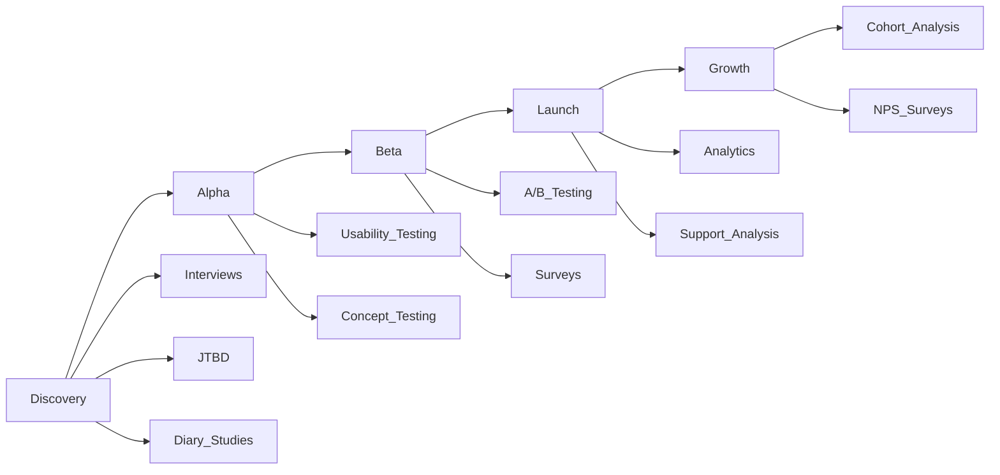

# 📊 FRAMEWORK COMPLET - DISCOVERY & RESEARCH 2025

> **Version:** 1.0 | **Dernière mise à jour:** Septembre 2025  
> **Objectif:** Base documentaire exhaustive pour la Discovery & Research en Product Management

---

## 🎯 1. CONTINUOUS DISCOVERY FRAMEWORK

### 1.1 Principes Fondamentaux

#### **Définition Teresa Torres**
La Continuous Discovery est le processus de conduire des activités de recherche régulières à travers des touchpoints hebdomadaires avec les clients, par l'équipe qui construit le produit.

#### **Les 4 piliers de la Continuous Discovery**
```
1. Cadence hebdomadaire minimale
2. Interaction directe avec les users
3. Implication de toute la trio produit
4. Focus sur les outcomes, pas les outputs
```

#### **Mindsets essentiels**
1. **Outcome-minded**: Focus sur les résultats business et user
2. **Customer-centric**: Les décisions partent toujours du client
3. **Collaborative**: Discovery = sport d'équipe
4. **Experimental**: Tester pour apprendre, pas pour confirmer
5. **Continuous**: Pas de phase "research", c'est permanent

### 1.2 Weekly Discovery Cadence

| **Jour** | **Activité** | **Participants** | **Output** |
|----------|--------------|------------------|------------|
| **Lundi** | 2-3 Customer interviews | Trio produit | Notes & insights |
| **Mardi** | Synthesis workshop | Équipe élargie | Opportunity mapping |
| **Mercredi** | Solution ideation | Cross-functional | Solution branches |
| **Jeudi** | Assumption testing prep | PM + Designer | Test protocols |
| **Vendredi** | Results review | Trio + stakeholders | Decision log |

### 1.3 La Trio Produit

#### **Composition optimale**
- **Product Manager**: Vision & priorités
- **Designer**: Experience & solutions
- **Engineer**: Faisabilité & implémentation

#### **Extension situationnelle**
- Data Scientist (pour ML/AI features)
- User Researcher (pour études complexes)
- Marketing (pour go-to-market insights)
- Support/Sales (pour feedback terrain)

### 1.4 Continuous vs Traditional Research

| **Aspect** | **Traditional** | **Continuous** |
|------------|-----------------|-----------------|
| **Fréquence** | Quarterly/Project-based | Weekly minimum |
| **Durée études** | 4-8 semaines | 1-3 jours |
| **Sample size** | 20-100+ users | 3-5 users/week |
| **Qui fait** | Research team | Product trio |
| **Focus** | Statistical significance | Rapid learning |
| **Décisions** | Big bets | Small experiments |
| **Documentation** | Heavy reports | Lightweight nuggets |

---

## 🔍 2. USER RESEARCH METHODS MATRIX

### 2.1 Classification des méthodes

#### **Dimensions clés**
```
Behavioral ←→ Attitudinal
Qualitative ←→ Quantitative  
Generative ←→ Evaluative
Remote ←→ In-person
Moderated ←→ Unmoderated
```

### 2.2 Top 23 Research Methods (2025)

#### **Discovery Methods (Generative)**

| **Méthode** | **Quand l'utiliser** | **Participants** | **Durée** |
|-------------|---------------------|------------------|-----------|
| **User Interviews** | Comprendre le "pourquoi" | 5-8 | 45-60 min |
| **Contextual Inquiry** | Observer in situ | 3-5 | 2-4h |
| **Diary Studies** | Comportements dans le temps | 8-12 | 1-4 semaines |
| **Field Studies** | Environnement naturel | 5-10 | 1-3 jours |
| **Focus Groups** | Perspectives multiples | 6-8 | 90 min |
| **Card Sorting** | Architecture info | 15-30 | 30 min |
| **Stakeholder Interviews** | Alignment interne | 5-10 | 30-45 min |
| **Literature Review** | État de l'art | N/A | 1-2 jours |
| **Competitive Analysis** | Benchmark marché | 3-5 competitors | 2-3 jours |

#### **Validation Methods (Evaluative)**

| **Méthode** | **Quand l'utiliser** | **Participants** | **Durée** |
|-------------|---------------------|------------------|-----------|
| **Usability Testing** | Tester prototypes | 5-7 | 30-45 min |
| **A/B Testing** | Optimisation | 1000+ | 1-4 semaines |
| **Concept Testing** | Valider idées | 10-15 | 20-30 min |
| **Tree Testing** | Navigation | 20-50 | 15 min |
| **First Click Testing** | Premier contact | 20+ | 5-10 min |
| **5-Second Test** | Première impression | 20+ | 2 min |
| **Preference Testing** | Choix design | 50+ | 5 min |
| **Surveys** | Quantifier attitudes | 100+ | 10-15 min |

#### **Mixed Methods (Hybride)**

| **Méthode** | **Quand l'utiliser** | **Output** |
|-------------|---------------------|------------|
| **Journey Mapping** | Vue holistique | Visual map |
| **Service Blueprint** | Processus complet | Org alignment |
| **Co-design Sessions** | Solutions participatives | Prototypes |
| **Design Sprint** | Rapid validation | Tested concept |
| **Analytics Review** | Behavioral patterns | Data insights |
| **Heuristic Evaluation** | Expert review | Issue list |

### 2.3 Méthodes par phase produit



### 2.4 Remote Research Toolkit 2025

#### **Outils essentiels**
- **Recruitment**: User Interviews, Respondent, Rally
- **Moderated**: Zoom, Lookback, UserZoom
- **Unmoderated**: Maze, Lyssna, UsabilityHub
- **Analytics**: Amplitude, Mixpanel, FullStory
- **Surveys**: Typeform, Survicate, Sprig
- **Card Sorting**: OptimalSort, Proven by Users
- **Prototyping**: Figma, Framer, ProtoPie

---

## 💼 3. JOBS-TO-BE-DONE (JTBD) FRAMEWORK

### 3.1 Core Theory

#### **Principe fondamental**
"People don't buy products; they hire them to do jobs."

#### **Les 3 dimensions du Job**
```
1. Functional Job - La tâche pratique
   "J'ai besoin de..."
   
2. Emotional Job - L'état désiré
   "Je veux me sentir..."
   
3. Social Job - L'image projetée
   "Je veux être perçu comme..."
```

### 3.2 JTBD Canvas

```
┌─────────────────────────────────────────────────┐
│                  JOB STATEMENT                   │
│         "Help me [achieve outcome] so I can      │
│          [benefit] when [situation]"             │
└─────────────────────────────────────────────────┘
                         │
         ┌───────────────┼───────────────┐
         ▼               ▼               ▼
   FUNCTIONAL       EMOTIONAL        SOCIAL
   - Task 1         - Feeling 1      - Image 1
   - Task 2         - Feeling 2      - Image 2
   - Task 3         - Feeling 3      - Image 3
         │               │               │
         └───────────────┼───────────────┘
                         ▼
                  HIRING CRITERIA
                  - Speed/Time
                  - Convenience  
                  - Price/Value
                  - Reliability
```

### 3.3 Job Story Format

#### **Template classique**
```
When [situation]
I want to [motivation]
So I can [expected outcome]
```

#### **Exemples concrets**
1. **B2C - Fitness App**
   - When: I'm feeling sluggish after work
   - I want to: Find a quick energizing workout
   - So I can: Feel accomplished and relaxed for the evening

2. **B2B - CRM Software**
   - When: A lead shows buying signals across channels
   - I want to: Get instant notification with context
   - So I can: Reach out at the perfect moment

3. **B2B2C - Payment Platform**
   - When: Customers abandon cart at checkout
   - I want to: Offer multiple payment options seamlessly
   - So I can: Reduce friction and increase conversion

### 3.4 Outcome-Driven Innovation (ODI)

#### **Structure des Desired Outcomes**
```
Direction + Metric + Object + Contextual Clarifier

Exemples:
- Minimize the time to find relevant information
- Increase the likelihood of successful first attempt
- Reduce the effort required to complete setup
```

#### **Critères d'un bon outcome**
✅ Solution-agnostic
✅ Mesurable
✅ Stable dans le temps
✅ Contrôlable par l'utilisateur
✅ Meaningful pour le business

### 3.5 JTBD Research Process

#### **Phase 1: Discovery Interviews**
```javascript
// Questions Timeline
Past: "Raconte-moi la première fois où..."
Present: "Quand était la dernière fois que..."
Future: "Imagine que tu pourrais..."

// Questions Forces
Push: "Qu'est-ce qui te frustre avec...?"
Pull: "Qu'est-ce qui t'attire dans...?"
Anxiety: "Qu'est-ce qui t'inquiète à propos de...?"
Habit: "Qu'est-ce qui te retient de changer?"
```

#### **Phase 2: Job Mapping**
1. Define the job executor
2. Define the job to be done
3. Identify job steps (8-15 steps)
4. Identify outcomes per step
5. Identify pain points
6. Prioritize opportunities

#### **Phase 3: Outcome Prioritization**

```
Opportunity Score = Importance + (Importance - Satisfaction)

Where:
- Importance: 1-10 scale
- Satisfaction: 1-10 scale
- Score > 15 = Extreme opportunity
- Score 12-15 = High opportunity
- Score < 10 = Low opportunity
```

### 3.6 JTBD vs Personas

| **Aspect** | **Personas** | **JTBD** |
|------------|--------------|----------|
| **Focus** | Who | Why |
| **Stabilité** | Change avec démographie | Stable dans le temps |
| **Segmentation** | Attributs | Circonstances |
| **Innovation** | Incrémentale | Disruptive |
| **Métriques** | Démographiques | Outcomes |

---

## 👤 4. PERSONAS MODERNES (BEYOND DEMOGRAPHICS)

### 4.1 Evolution des Personas 2025

#### **Old School Personas**
```
❌ Focus démographique (âge, genre, revenu)
❌ Stock photos génériques
❌ Assumptions non validées
❌ Static documents
❌ Vanity metrics
```

#### **Modern Behavioral Personas**
```
✅ Behavioral patterns observés
✅ Real user quotes & photos
✅ Data-driven insights
✅ Living documents (AI-updated)
✅ Actionable triggers
```

### 4.2 Behavioral Persona Canvas

```
┌──────────────────────────────────────────────────────────┐
│ PERSONA NAME: [Behavioral Archetype, not "Sarah, 35"]    │
├──────────────────────────────────────────────────────────┤
│                                                           │
│ BEHAVIORAL PATTERNS          │  DECISION ARCHITECTURE    │
│ □ Frequency of use          │  • Motivational structure │
│ □ Feature adoption path     │  • Risk tolerance level   │
│ □ Engagement patterns       │  • Information processing │
│ □ Drop-off points          │  • Social proof needs     │
│                             │                            │
│ OBSERVABLE ACTIONS          │  EMOTIONAL JOURNEY         │
│ "When they..."             │  Frustration ←→ Delight    │
│ • Action 1 → Result        │  ████░░░░░░░░░░░░░░░      │
│ • Action 2 → Result        │                            │
│                             │                            │
│ JTBD ALIGNMENT             │  CONTEXT & CONSTRAINTS     │
│ Primary: [Main job]        │  • Environment factors     │
│ Secondary: [Support jobs]   │  • Time constraints       │
│                            │  • Technical literacy      │
│                            │  • Organizational barriers │
└──────────────────────────────────────────────────────────┘
```

### 4.3 Data-Driven Persona Development

#### **Sources de données**
1. **Quantitative Behavioral**
   - Product analytics (Amplitude, Mixpanel)
   - Heatmaps & session recordings
   - A/B test results
   - Cohort analyses

2. **Qualitative Behavioral**
   - Interview transcripts
   - Support tickets analysis
   - Social media monitoring
   - User feedback patterns

3. **AI-Enhanced Insights**
   - NLP sentiment analysis
   - Clustering algorithms
   - Predictive behavioral models
   - Dynamic persona updates

### 4.4 Persona Segmentation Methods

#### **1. Behavioral Segmentation**
```python
segments = {
    "Power Users": {
        "usage": ">20 sessions/week",
        "features": "Advanced tools",
        "value": "Efficiency gains"
    },
    "Casual Browsers": {
        "usage": "2-3 sessions/month",
        "features": "Basic discovery",
        "value": "Inspiration"
    },
    "Mission-Driven": {
        "usage": "Burst patterns",
        "features": "Specific workflows",
        "value": "Task completion"
    }
}
```

#### **2. Jobs-Based Segmentation**
- Segment by primary job-to-be-done
- Group by circumstances, not demographics
- Focus on outcome importance

#### **3. Lifecycle Segmentation**
```
Activation → Engagement → Retention → Expansion → Advocacy
    ↓            ↓            ↓           ↓          ↓
 Persona A   Persona B   Persona C   Persona D   Persona E
```

### 4.5 Persona Validation & Testing

#### **Validation Metrics**
- Behavioral prediction accuracy
- Conversion rate by persona
- Feature adoption patterns
- Support ticket categorization
- Retention curves alignment

#### **Testing Framework**
1. **Hypothesis**: Persona X will [behavior] when [trigger]
2. **Test**: A/B test messaging/features
3. **Measure**: Engagement metrics
4. **Learn**: Refine or pivot persona
5. **Iterate**: Continuous refinement

### 4.6 Persona Application Matrix

| **Use Case** | **Traditional Persona** | **Behavioral Persona** | **JTBD** |
|--------------|------------------------|------------------------|----------|
| **Messaging** | Demographics-based | Behavior-triggered | Outcome-focused |
| **Features** | Assumed needs | Observed patterns | Job completion |
| **Onboarding** | One-size-fits-all | Path-dependent | Goal-oriented |
| **Pricing** | Income-based | Value perception | Willingness to pay |
| **Support** | Generic FAQs | Context-aware | Problem-solving |

---

## 🗺️ 5. CUSTOMER JOURNEY MAPPING

### 5.1 Modern Journey Mapping Framework

#### **Journey Map Anatomy**
```
PHASES:     Discover → Evaluate → Purchase → Onboard → Use → Expand → Renew
              ↓          ↓          ↓         ↓        ↓      ↓        ↓
ACTIONS:    [What users do at each phase]
THOUGHTS:   [What users think]
EMOTIONS:   [Emotional curve: 😔 😐 😊]
TOUCHPOINTS:[Channels & interactions]
PAIN POINTS:[Friction & frustrations]
OPPORTUNITIES:[Improvement areas]
METRICS:    [KPIs per phase]
```

### 5.2 Types of Journey Maps

#### **1. Current State Map**
- Documents today's reality
- Based on actual research
- Identifies pain points
- Baseline for improvement

#### **2. Future State Map**
- Vision of ideal experience
- Innovation opportunities
- Strategic alignment
- Change roadmap

#### **3. Day-in-Life Map**
- Beyond product interactions
- Holistic context
- Competitor touchpoints
- Unmet needs discovery

#### **4. Service Blueprint Integration**
- Frontend + Backend
- Operational dependencies
- System requirements
- Cross-functional alignment

### 5.3 Journey Mapping Process

#### **Step 1: Define Scope**
```yaml
persona: Primary user segment
scenario: Specific journey to map
channels: In-scope touchpoints
timeline: Journey duration
success: Desired outcome
```

#### **Step 2: Gather Data**
- Analytics data per phase
- Interview insights
- Support tickets analysis
- Session recordings
- Survey responses
- Social listening

#### **Step 3: Workshop Format**
```
Duration: 2-4 hours
Participants: 6-8 (cross-functional)
Materials:
  - Journey template (wall-size)
  - Sticky notes (multiple colors)
  - Sharpies
  - Dot stickers (voting)
  - Timer
  
Agenda:
  15 min - Context & goals
  30 min - Phase mapping
  45 min - Actions & touchpoints
  30 min - Emotions & thoughts
  45 min - Pain points & opportunities
  15 min - Prioritization
```

#### **Step 4: Synthesis & Visualization**

```
Digital Tools:
- Miro/FigJam (collaborative)
- Smaply (specialized)
- UXPressia (comprehensive)
- TheyDo (enterprise)
```

### 5.4 Emotional Journey Mapping

#### **Emotion Curve Technique**
```
Delight    ──────────────────
           │                 ╱
Satisfied  │        ╱─────── 
           │   ╱───╱
Neutral    ────
           │        ╲
Frustrated │         ╲───────
           │
Angry      ──────────────────
           Phase1  Phase2  Phase3
```

#### **Moments of Truth**
1. **First Moment**: Initial impression
2. **Zero Moment**: Research phase
3. **Critical Moment**: Make-or-break point
4. **Peak Moment**: Best experience
5. **End Moment**: Last impression

### 5.5 Journey Analytics & Measurement

#### **Journey KPIs Framework**
```javascript
const journeyMetrics = {
  discovery: {
    awareness: "Brand search volume",
    consideration: "Content engagement rate"
  },
  evaluation: {
    comparison: "Feature page views",
    trial: "Trial sign-up rate"
  },
  purchase: {
    conversion: "Purchase completion rate",
    abandonment: "Cart abandonment rate"
  },
  onboarding: {
    activation: "Time to first value",
    completion: "Onboarding completion %"
  },
  retention: {
    engagement: "DAU/MAU ratio",
    satisfaction: "NPS by cohort"
  }
}
```

### 5.6 Non-Linear Journey Mapping

#### **Reality: Journeys are Messy**
```
Traditional (Linear):
Start → Step 1 → Step 2 → Step 3 → End

Reality (Non-Linear):
Start → Step 2 → Back to Start → Step 1 → 
External Research → Step 3 → Competitor → 
Step 2 → Purchase → Return → Repurchase
```

#### **Mapping Techniques for Non-Linear**
- Multiple entry points
- Loop-backs and recursion
- Parallel paths
- External influences
- Abandoned journeys
- Re-engagement flows

---

## 🏗️ 6. SERVICE BLUEPRINTING

### 6.1 Service Blueprint Architecture

```
┌────────────────────────────────────────────────────────────┐
│ CUSTOMER JOURNEY PHASES                                     │
├────────────────────────────────────────────────────────────┤
│ CUSTOMER ACTIONS                                           │
│ What the customer does                                     │
├────────────────────────────────────────────────────────────┤
│ FRONTSTAGE (Visible)                                       │
│ Customer-facing interactions & touchpoints                 │
├────────────── LINE OF INTERACTION ────────────────────────┤
│ BACKSTAGE (Invisible to customer)                          │
│ Behind-scenes employee actions                             │
├────────────── LINE OF VISIBILITY ──────────────────────────┤
│ SUPPORT PROCESSES                                          │
│ Internal actions & systems                                 │
├────────────────────────────────────────────────────────────┤
│ PHYSICAL/DIGITAL EVIDENCE                                  │
│ Tangible elements customer experiences                     │
├────────────────────────────────────────────────────────────┤
│ METRICS & TIME                                             │
│ Duration, SLAs, KPIs per step                             │
└────────────────────────────────────────────────────────────┘
```

### 6.2 Service Blueprint Components

#### **1. Customer Actions**
- Observable behaviors
- Decision points
- Interactions initiated
- Channel switches

#### **2. Frontstage Actions**
- Employee interactions (direct)
- Self-service interfaces
- Automated responses
- Physical touchpoints

#### **3. Backstage Actions**
- Employee actions (invisible)
- Preparation work
- Coordination efforts
- Quality checks

#### **4. Support Processes**
- IT systems
- Third-party services
- Internal tools
- Data flows

#### **5. Physical/Digital Evidence**
- Emails/notifications
- UI screens
- Documents
- Physical products

### 6.3 Service Blueprint Creation Process

#### **Phase 1: Preparation**
```yaml
Define:
  - Service scope
  - Start/end points
  - Key scenarios
  - Success metrics
  
Research:
  - Customer journey data
  - Employee interviews
  - System documentation
  - Process flows
```

#### **Phase 2: Collaborative Mapping**
```
Workshop Setup:
  Duration: 4-6 hours
  Participants:
    - Frontline staff (2-3)
    - Operations (2-3)
    - Technology (1-2)
    - Design/UX (1-2)
    - Product (1-2)
  
  Materials:
    - Large wall space/whiteboard
    - Sticky notes (5 colors)
    - Markers
    - String/tape (for lines)
    - Camera for documentation
```

#### **Phase 3: Deep Dive Mapping**
1. Map customer actions (blue stickies)
2. Add frontstage touchpoints (green)
3. Document backstage actions (yellow)
4. Identify support processes (orange)
5. Note pain points (red)
6. Draw connections and dependencies
7. Add time estimates
8. Identify failure points

### 6.4 Service Blueprint Patterns

#### **Pattern 1: Omnichannel Service**
```
Channel A → Handoff → Channel B → Merge → Channel C
    ↓          ↓          ↓         ↓        ↓
[Backstage coordination required at each transition]
```

#### **Pattern 2: Self-Service with Escalation**
```
Self-Service → Stuck → Human Support → Resolution
      ↓          ↓           ↓             ↓
   System     Detection   Routing      Follow-up
```

#### **Pattern 3: Proactive Service**
```
Trigger Event → Prediction → Proactive Outreach → Prevention
       ↓            ↓              ↓                  ↓
   Monitoring    ML Model     Automation         Measurement
```

### 6.5 Blueprint Metrics & Analysis

#### **Operational Metrics**
```javascript
const blueprintMetrics = {
  efficiency: {
    stepDuration: "Time per action",
    waitTime: "Customer wait periods",
    handoffs: "Number of transitions",
    rework: "Error correction rate"
  },
  quality: {
    accuracy: "First-time right %",
    satisfaction: "CSAT per touchpoint",
    effort: "Customer effort score",
    completion: "Journey completion rate"
  },
  cost: {
    perInteraction: "Cost per touchpoint",
    channelCost: "Relative channel costs",
    failureCost: "Cost of failure points"
  }
}
```

### 6.6 Blueprint-to-Roadmap Translation

#### **From Insights to Action**
1. **Identify Quick Wins**
   - High impact, low effort
   - Backstage optimizations
   - Automation opportunities

2. **Major Initiatives**
   - System replacements
   - Process redesigns
   - New capabilities

3. **Strategic Transformations**
   - Channel strategies
   - Operating model changes
   - Platform decisions

---

## 📈 7. EXPERIENCE MAPPING TOOLS

### 7.1 Assumption Mapping

#### **Assumption Categories**
```
Known Knowns     → Facts we can prove
Known Unknowns   → Questions we have
Unknown Unknowns → Blind spots
```

#### **Assumption Testing Matrix**
```
         High Impact
              ↑
    Critical  |  Important
    Test Now  |  Test Soon
    ----------|------------
    Monitor   |  Ignore
    Later     |  For Now
              ↓
         Low Impact
    ← Low Risk    High Risk →
```

### 7.2 Empathy Mapping

```
┌─────────────────────────────────────┐
│            THINK & FEEL             │
│     Worries | Aspirations           │
├──────────┬──────────┬───────────────┤
│   HEAR   │   USER   │     SEE       │
│ Influences│  [Name]  │ Environment   │
├──────────┴──────────┴───────────────┤
│            SAY & DO                 │
│    Public behavior | Actions        │
├─────────────────────────────────────┤
│  PAINS              │    GAINS      │
│ Frustrations        │ Wants/Needs   │
└─────────────────────────────────────┘
```

### 7.3 Stakeholder Mapping

#### **Influence/Interest Grid**
```
       High Interest
            ↑
   Manage    |  Engage
   Closely   |  Actively
   ----------|----------
   Monitor   |  Keep
   Minimum   |  Informed
            ↓
       Low Interest
   ← Low Power   High Power →
```

### 7.4 Ecosystem Mapping

#### **Components**
- Direct competitors
- Indirect competitors
- Complementary services
- Platform dependencies
- Regulatory environment
- Partner network
- Supply chain

---

## 🔬 8. RESEARCH OPERATIONS (ResearchOps)

### 8.1 Research Repository Structure

```
/research-repository
├── /studies
│   ├── /2025-Q1
│   │   ├── /study-001-onboarding
│   │   │   ├── protocol.md
│   │   │   ├── participants.csv
│   │   │   ├── /recordings
│   │   │   ├── /transcripts
│   │   │   └── findings.md
│   └── /templates
├── /insights
│   ├── /personas
│   ├── /jobs-to-be-done
│   ├── /journey-maps
│   └── /opportunity-areas
├── /knowledge-base
│   ├── /best-practices
│   ├── /methods-guides
│   └── /tools-documentation
└── /dashboards
    ├── insights-tracker
    └── impact-metrics
```

### 8.2 Research Democratization

#### **Self-Service Research Tools**
1. **Templates Library**
   - Interview guides
   - Survey templates
   - Test protocols
   - Analysis frameworks

2. **Training Program**
   - Basic research methods
   - Bias awareness
   - Ethics & consent
   - Tool usage

3. **Quality Standards**
   - Minimum sample sizes
   - Documentation requirements
   - Review process
   - Insight criteria

### 8.3 Research Impact Measurement

```javascript
const researchROI = {
  efficiency: {
    decisionSpeed: "Time to decision -30%",
    reworkReduction: "Feature pivots -50%",
    meetingTime: "Alignment meetings -40%"
  },
  effectiveness: {
    featureAdoption: "Adoption rate +25%",
    customerSat: "NPS improvement +15",
    supportTickets: "Issue reduction -35%"
  },
  innovation: {
    newOpportunities: "Opportunities discovered",
    marketFit: "PMF achievement time",
    competitiveAdv: "Unique insights gained"
  }
}
```

### 8.4 Research Ethics Framework

#### **Principles**
1. **Informed Consent**: Clear, documented
2. **Privacy**: Data protection compliant
3. **Transparency**: Purpose & usage clear
4. **Inclusivity**: Representative sampling
5. **Harm Prevention**: Psychological safety
6. **Compensation**: Fair participant payment

#### **GDPR/Privacy Considerations**
- Data minimization
- Purpose limitation
- Storage limitation
- Right to deletion
- Anonymization practices
- Cross-border transfers

---

## 🤖 9. AI-AUGMENTED RESEARCH

### 9.1 AI Research Applications 2025

#### **1. Synthesis Automation**
```python
AI_capabilities = {
    "transcription": "Real-time, multi-language",
    "thematic_analysis": "Pattern detection",
    "sentiment_analysis": "Emotional mapping",
    "insight_extraction": "Key findings",
    "report_generation": "Automated summaries"
}
```

#### **2. Predictive Research**
- Behavioral prediction models
- Churn risk identification
- Feature adoption forecasting
- Persona evolution tracking

#### **3. Research Participant Matching**
- AI-powered screening
- Behavioral matching
- Availability optimization
- Diversity balancing

### 9.2 Tools & Platforms

#### **AI-Enhanced Research Tools**
- **Dovetail**: AI tagging & insights
- **Notably**: AI research repository
- **Grain**: AI meeting insights
- **Otter.ai**: Transcription & summary
- **MonkeyLearn**: Text analysis
- **Obviously AI**: No-code predictions

### 9.3 Human + AI Collaboration

#### **Best Practices**
```
Human Does:             AI Does:
- Frame questions       - Process volume
- Contextual nuance    - Pattern detection  
- Ethical decisions    - Repetitive tasks
- Creative synthesis   - Initial clustering
- Stakeholder comms    - Documentation
```

---

## 📊 10. RESEARCH SYNTHESIS & COMMUNICATION

### 10.1 Synthesis Frameworks

#### **Affinity Diagramming Process**
```
1. Data Collection
   ↓
2. Note Creation (1 insight per sticky)
   ↓
3. Individual Sorting
   ↓
4. Team Clustering
   ↓
5. Theme Identification
   ↓
6. Insight Statements
   ↓
7. Opportunity Mapping
```

### 10.2 Atomic Research Method

#### **Research Nugget Structure**
```yaml
nugget:
  id: RN-2025-001
  date: 2025-09-20
  study: Onboarding Research
  
  evidence:
    observation: "Users skip the tutorial"
    quote: "I just want to explore myself"
    data: "73% skip rate"
  
  insight:
    statement: "Users prefer exploration over guidance"
    confidence: HIGH
    
  impact:
    personas: [Self-Directed Learners]
    journey_phase: Onboarding
    opportunity_size: Large
    
  tags: [onboarding, tutorials, user-autonomy]
```

### 10.3 Research Communication

#### **Formats par audience**

| **Audience** | **Format** | **Focus** | **Duration** |
|--------------|------------|-----------|--------------|
| **C-Suite** | Executive summary | Business impact | 5 min |
| **Product Team** | Workshop | Opportunities | 2 hours |
| **Engineering** | Technical brief | Feasibility | 30 min |
| **Design** | Journey artifacts | Experience | 1 hour |
| **Marketing** | Persona stories | Messaging | 45 min |

#### **Storytelling Structure**
```
1. Hook: Surprising insight
2. Context: Research background
3. Discovery: Key findings
4. Impact: What it means
5. Action: Next steps
```

### 10.4 Research Artifacts Gallery

#### **Living Documents**
- Digital walls (Miro/FigJam)
- Interactive dashboards
- Video highlights reels
- Insight newsletters
- Slack automated updates

#### **Immersive Experiences**
- Persona rooms
- Journey galleries
- Experience theaters
- Empathy sessions
- Customer panels

---

## 🎯 11. RESEARCH PLANNING & PRIORITIZATION

### 11.1 Research Roadmap

```
Q1: Foundational Research
    - Personas validation
    - JTBD discovery
    - Journey baseline
    
Q2: Problem Space
    - Opportunity sizing
    - Concept testing
    - Competitive analysis
    
Q3: Solution Validation  
    - Prototype testing
    - Pricing research
    - Beta feedback
    
Q4: Optimization
    - A/B testing
    - Usability improvements
    - Satisfaction tracking
```

### 11.2 Research Request Prioritization

#### **ICE Scoring for Research**
```
Score = (Impact × Confidence × Ease) / Effort

Where:
- Impact: Business value (1-10)
- Confidence: Research will answer (1-10)
- Ease: Accessibility of users (1-10)
- Effort: Research complexity (1-10)
```

### 11.3 Research Sprint Format

#### **5-Day Research Sprint**
```
Monday:    Define questions & recruit
Tuesday:   Conduct research sessions
Wednesday: Synthesis & pattern finding
Thursday:  Ideation & solutioning
Friday:    Share-out & planning
```

---

## 📈 12. CONTINUOUS DISCOVERY METRICS

### 12.1 Discovery Health Metrics

```javascript
const discoveryHealth = {
  frequency: {
    customerTouchpoints: ">3 per week",
    teamParticipation: ">80% involved",
    insightGeneration: ">5 per week"
  },
  quality: {
    insightActionability: ">70% actionable",
    decisionInfluence: ">50% decisions informed",
    assumptionAccuracy: ">60% validated"
  },
  impact: {
    featureSuccess: "+30% adoption vs baseline",
    cycleTime: "-25% idea to launch",
    customerSatisfaction: "+20 NPS points"
  }
}
```

### 12.2 Research Velocity Tracking

#### **Velocity Metrics**
- Time from question to insight
- Insights per researcher per month
- Studies completed vs planned
- Participant recruitment speed
- Synthesis to action time

### 12.3 Outcome Attribution

#### **Connecting Research to Results**
1. Tag initiatives with research IDs
2. Track feature performance
3. Measure vs hypothesis
4. Calculate research ROI
5. Share success stories

---

## 🚀 13. RESEARCH TOOLS STACK 2025

### 13.1 Essential Tool Categories

#### **Recruitment & Scheduling**
```yaml
Consumer: User Interviews, Respondent
B2B: Wynter, GLG Insights  
Scheduling: Calendly, SavvyCal
Incentives: Tremendous, Rybbon
```

#### **Data Collection**
```yaml
Interviews: Zoom, Lookback, Teams
Surveys: Typeform, Tally, Qualtrics
Usability: Maze, Lyssna, UserZoom
Analytics: Amplitude, Mixpanel, Heap
Heatmaps: Hotjar, FullStory, Clarity
```

#### **Analysis & Synthesis**
```yaml
Qualitative: Dovetail, Condens, Aurelius
Quantitative: Tableau, Looker, Mode
AI-Assisted: Notably, Viable, MonkeyLearn
Whiteboards: Miro, FigJam, Whimsical
```

#### **Repository & Sharing**
```yaml
Knowledge: Notion, Confluence, Coda
Artifacts: Figma, Sketch, Abstract
Videos: Loom, Vidyard, Wistia
Insights: Airtable, Productboard
```

### 13.2 Integrated Research Stack

```
[Recruitment] → [Collection] → [Analysis] → [Repository]
      ↓             ↓              ↓            ↓
User Interviews → Zoom      → Dovetail  → Notion
      +             +              +            +
  Calendly     Maze/Surveys   Amplitude   Figma/Miro
```

---

## 🎓 14. RESEARCH SKILLS DEVELOPMENT

### 14.1 Core Research Competencies

#### **Foundational Skills**
- [ ] Interview techniques
- [ ] Survey design
- [ ] Usability testing
- [ ] Data analysis basics
- [ ] Synthesis methods
- [ ] Presentation skills

#### **Advanced Skills**
- [ ] Statistical analysis
- [ ] Ethnographic research
- [ ] Service design
- [ ] Behavioral economics
- [ ] Systems thinking
- [ ] Facilitation mastery

### 14.2 Learning Resources

#### **Books Essentiels**
- "Continuous Discovery Habits" - Teresa Torres
- "The Mom Test" - Rob Fitzpatrick
- "Observing the User Experience" - Kuniavsky
- "Rocket Surgery Made Easy" - Steve Krug
- "Jobs to Be Done" - Tony Ulwick

#### **Courses & Certifications**
- NN/g UX Certification
- Coursera UX Research
- User Interviews Field Guide
- Reforge User Insights
- IDEO U Design Research

#### **Communities**
- Mixed Methods Slack
- ResearchOps Community
- User Research London
- UXR Collective
- Rosenfeld Media

---

## ✅ 15. RESEARCH QUALITY CHECKLIST

### 15.1 Pre-Research Checklist

- [ ] Research questions defined
- [ ] Success metrics identified  
- [ ] Method selection justified
- [ ] Participants recruited (diverse)
- [ ] Ethics & consent prepared
- [ ] Team roles assigned
- [ ] Tools tested
- [ ] Pilot session completed

### 15.2 During Research Checklist

- [ ] Consent documented
- [ ] Recording started
- [ ] Notes taken (observer)
- [ ] Time managed
- [ ] Probing questions asked
- [ ] Bias monitored
- [ ] Technical issues logged
- [ ] Thank you & incentive

### 15.3 Post-Research Checklist

- [ ] Debrief completed (same day)
- [ ] Data secured & anonymized
- [ ] Transcription initiated
- [ ] Initial patterns noted
- [ ] Repository updated
- [ ] Stakeholders informed
- [ ] Next sessions scheduled
- [ ] Thank you email sent

---

## 📋 16. TEMPLATES & FRAMEWORKS

### 16.1 Interview Guide Template

```markdown
# Interview Guide: [Topic]

## Opening (5 min)
- Introduction & consent
- Permission to record
- Interview structure overview

## Warm-up (5 min)
- Tell me about your role
- How does [topic] fit into your day?

## Main Questions (30 min)
### Experience Questions
- Walk me through the last time you...
- What happened before/after that?

### Problem Questions  
- What's the hardest part about...?
- Why is that hard?

### Solution Questions
- How do you handle that today?
- What would better look like?

## Wrap-up (5 min)
- Anything else important?
- Can we follow up?
- Thank you & next steps
```

### 16.2 Research Brief Template

```markdown
# Research Brief: [Project Name]

## Background
[Context and why this research matters]

## Research Questions
1. Primary: 
2. Secondary:
3. Tertiary:

## Method
[Chosen method and justification]

## Participants
- Criteria:
- Sample size:
- Recruitment:

## Timeline
- Planning: [Dates]
- Execution: [Dates]
- Analysis: [Dates]
- Share-out: [Date]

## Team
- Lead:
- Support:
- Stakeholders:

## Deliverables
- [ ] Report
- [ ] Presentation
- [ ] Artifacts

## Success Metrics
[How we'll measure impact]
```

### 16.3 Insight Statement Template

```markdown
# Insight: [Title]

## Observation
We observed that [specific behavior/pattern]

## Data
- Qual: [# of users] mentioned/did [what]
- Quant: [metric] shows [pattern]

## Insight
This means that [interpretation]
Because [reasoning]

## Opportunity
How might we [opportunity question]?

## Impact
- User value:
- Business value:
- Feasibility:

## Next Steps
- [ ] Action 1
- [ ] Action 2
```

---

## 🎯 17. ANTI-PATTERNS À ÉVITER

### 17.1 Research Anti-patterns

❌ **Research Theater**: Research pour la forme sans impact
❌ **Confirmation Bias**: Chercher uniquement ce qui confirme
❌ **Analysis Paralysis**: Trop de research, pas assez d'action
❌ **Golden User**: Sur-indexer sur users vocaux
❌ **Method Fixation**: Toujours la même méthode
❌ **Silo Research**: Pas de partage cross-team
❌ **Vanity Metrics**: Mesurer volume, pas impact
❌ **One and Done**: Pas de suivi/validation

### 17.2 Discovery Anti-patterns

❌ **Feature Factory Mode**: Solutions sans problems
❌ **Outsourced Discovery**: Déléguer totalement
❌ **Sporadic Research**: Seulement en crise
❌ **Executive Override**: Ignorer les insights
❌ **Perfect Research**: Attendre conditions parfaites
❌ **Data Hoarding**: Collecter sans synthétiser

---

## 🚦 18. IMPLEMENTATION ROADMAP

### 18.1 Maturity Model

#### **Level 1: Ad-hoc**
- Research ponctuelle
- Pas de process
- Individual efforts

#### **Level 2: Planned**
- Research projects
- Some documentation
- Team involvement

#### **Level 3: Continuous**
- Weekly cadence
- Repository active
- Cross-functional

#### **Level 4: Embedded**
- Research culture
- Democratized tools
- Impact measured

#### **Level 5: Strategic**
- Research drives strategy
- Predictive insights
- Innovation engine

### 18.2 30-60-90 Day Plan

#### **Days 1-30: Foundation**
- [ ] Assess current state
- [ ] Define research charter
- [ ] Set up basic tools
- [ ] Start weekly interviews
- [ ] Create first journey map

#### **Days 31-60: Momentum**
- [ ] Establish repository
- [ ] Train team members
- [ ] Complete JTBD study
- [ ] Run first sprint
- [ ] Share first insights

#### **Days 61-90: Scale**
- [ ] Automate recruitment
- [ ] Implement metrics
- [ ] Expand methods
- [ ] Build stakeholder rhythm
- [ ] Measure first impact

---

## 📚 19. ADVANCED FRAMEWORKS

### 19.1 Kano Model Application

```
         Satisfaction
              ↑
         Delighters
           ╱
     ────────────── Performance
        ╱
   Must-Haves
              → Feature Presence
```

### 19.2 Design Thinking Integration

```
Empathize → Define → Ideate → Prototype → Test
    ↓         ↓        ↓         ↓         ↓
Research   Problem  Solution  Build     Validate
Methods    Framing  Generation Quickly   Learn
```

### 19.3 Lean UX Cycle

```
Build → Measure → Learn
  ↑        ↓        ↓
Think ← Research ← Analyze
```

---

## 🎬 CONCLUSION

### Key Takeaways

1. **Continuous > Periodic**: Weekly touchpoints transforment
2. **Behavioral > Demographic**: Actions révèlent plus que attributs
3. **Synthesis > Collection**: La valeur est dans les patterns
4. **Cross-functional > Siloed**: Discovery = team sport
5. **Impact > Activity**: Mesurer outcomes, pas outputs

### Success Metrics

- **Frequency**: ≥3 customer contacts/week
- **Participation**: ≥80% team involvement
- **Velocity**: <2 weeks question→insight
- **Impact**: ≥30% feature adoption improvement
- **ROI**: 10x return on research investment

### Next Actions

1. Start with one weekly customer interview
2. Create your first behavioral persona
3. Map one critical journey
4. Build a simple research repository
5. Measure one research impact metric

---

> 💬 **"Fall in love with the problem, not the solution."**

---

**Dernière mise à jour:** Septembre 2025  
**Version:** 1.0  
**Maintenu par:** Research Operations Team  
**Contact:** research@company.com