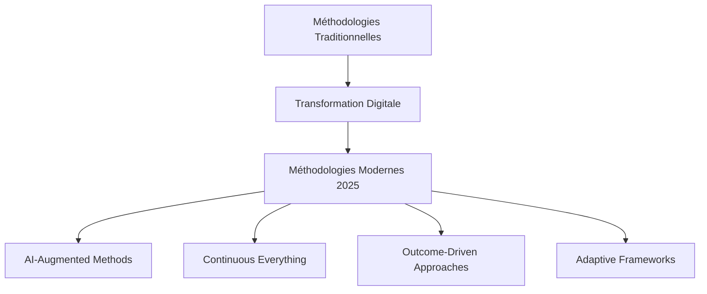
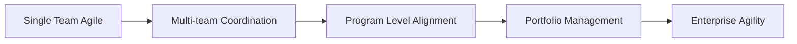
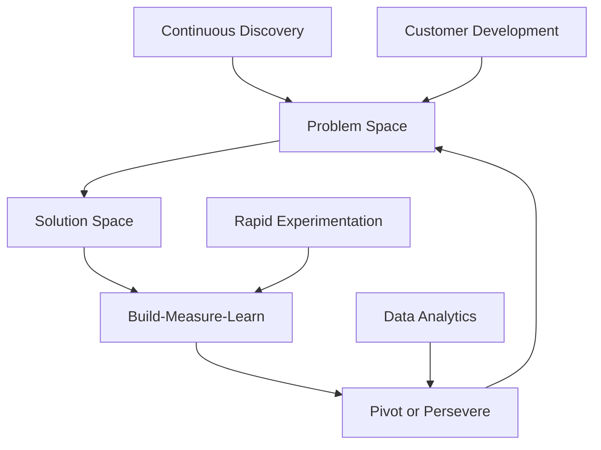
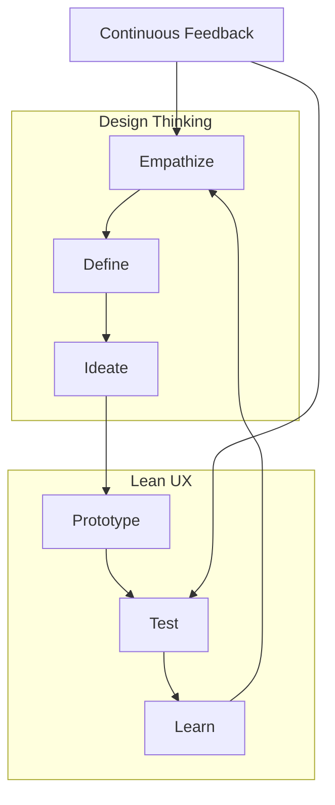
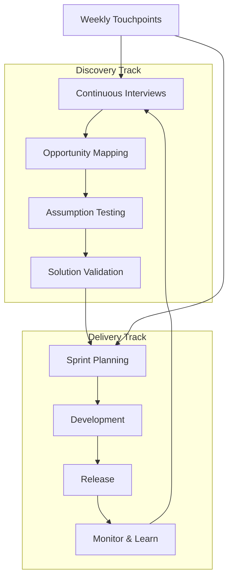
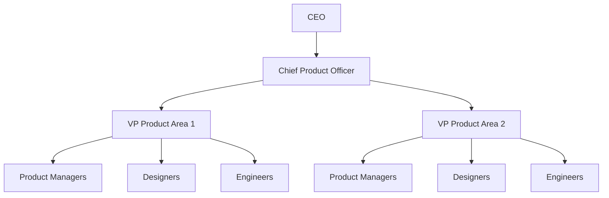
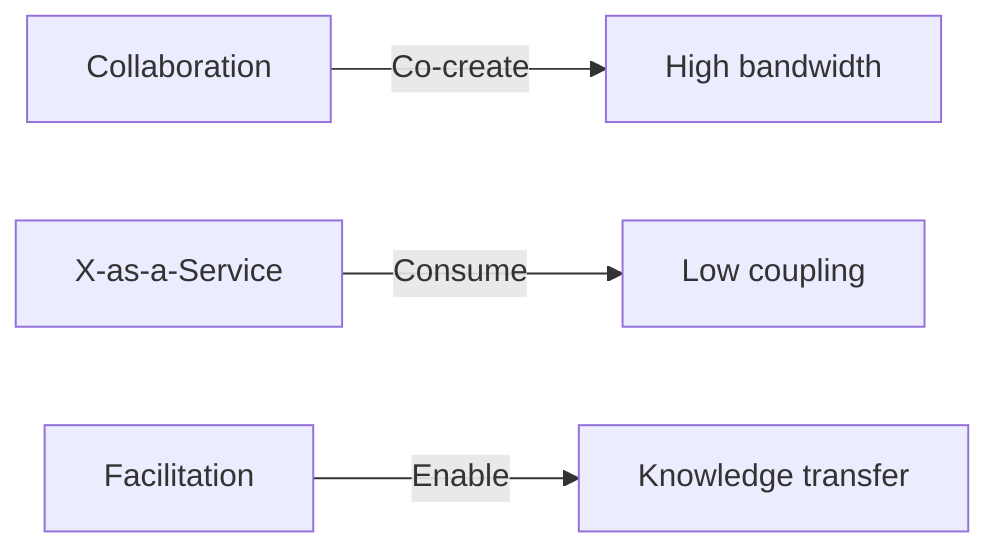
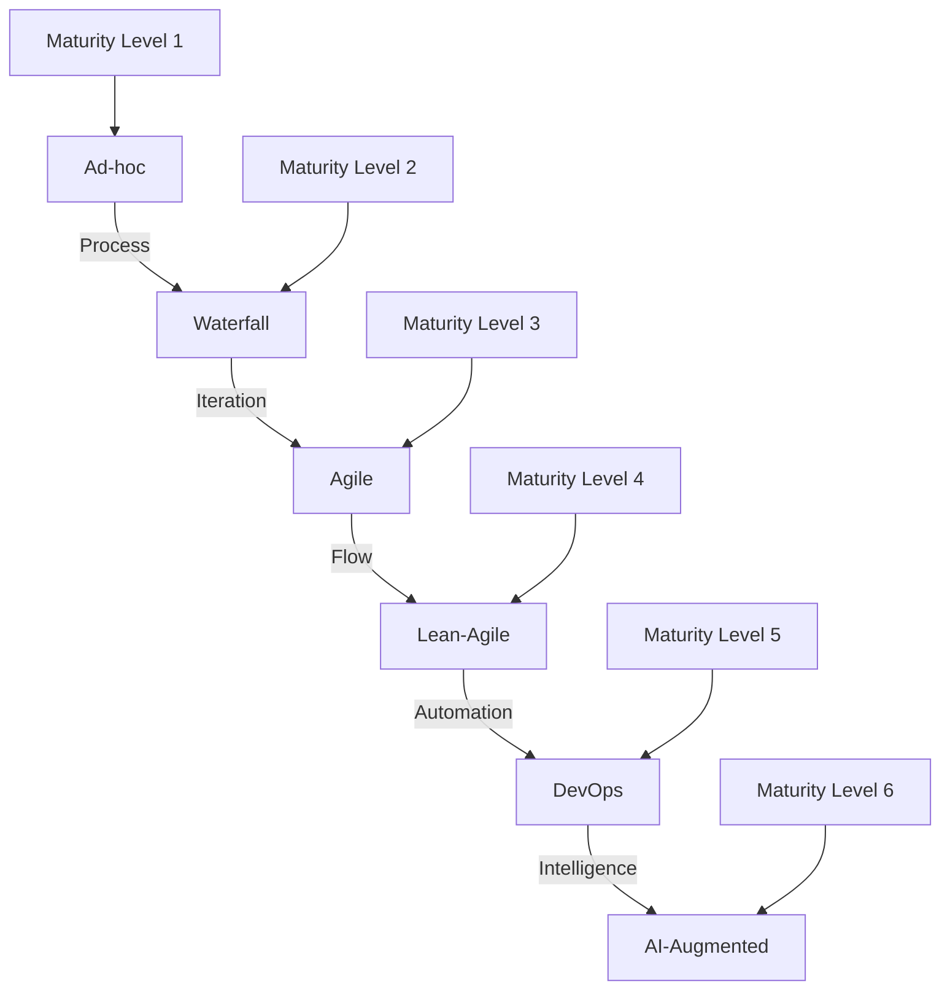
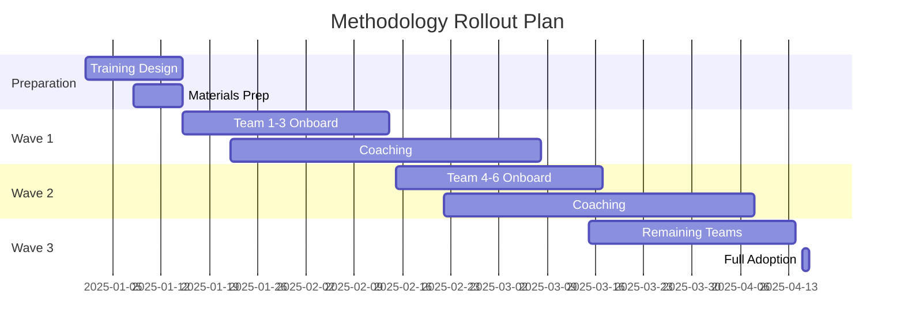

# 📚 FRAMEWORK COMPLET - MÉTHODOLOGIES & FRAMEWORKS PM 2025

> **Version:** 1.0 | **Dernière mise à jour:** Septembre 2025
> **Objectif:** Guide exhaustif des méthodologies modernes de Product Management et leur orchestration pratique

## 📋 TABLE DES MATIÈRES

1. [Introduction - L'Évolution Méthodologique](#introduction)
2. [Agile at Scale - Patterns 2025](#agile-at-scale)
3. [Lean Product Development](#lean-product)
4. [Design Thinking × Lean UX](#design-thinking-lean)
5. [Shape Up Methodology](#shape-up)
6. [Continuous Discovery × Delivery](#continuous-discovery-delivery)
7. [Product Operating Models](#product-operating-models)
8. [Team Topologies Product](#team-topologies)
9. [Méthodologies Hybrides](#methodologies-hybrides)
10. [Implementation Roadmap](#implementation-roadmap)
11. [Anti-Patterns & Pièges](#anti-patterns)
12. [Métriques de Maturité](#metriques-maturite)

---

## 1. INTRODUCTION - L'ÉVOLUTION MÉTHODOLOGIQUE {#introduction}

### Le Contexte 2025



### Les Paradigmes Fondamentaux

#### 1. **Post-Agile Era**
- Agile comme baseline, pas comme destination
- Focus sur les outcomes vs outputs
- Adaptation contextuelle vs dogmatisme méthodologique

#### 2. **Continuous Everything**
- Discovery × Delivery × Learning
- Feedback loops ultra-courts
- Adaptation en temps réel

#### 3. **AI-First Methodologies**
- Augmentation des processus par l'IA
- Data-driven decision making
- Predictive product management

### La Matrice de Sélection Méthodologique

| Contexte | Méthodologie Recommandée | Indicateurs Clés |
|----------|--------------------------|------------------|
| Startup Early Stage | Lean Startup + Continuous Discovery | Velocity, Learning Rate |
| Scale-up | Shape Up + OKRs | Focus, Impact |
| Enterprise | SAFe/LeSS + Team Topologies | Alignment, Flow |
| Platform | Dual-track + API-First | Ecosystem Health |
| Innovation Lab | Design Sprint + Lean UX | Time to Insight |

---

## 2. AGILE AT SCALE - PATTERNS 2025 {#agile-at-scale}

### 2.1 L'Évolution des Frameworks

#### **SAFe 6.0 (Scaled Agile Framework)**

```yaml
Configuration Optimale:
  Essential_SAFe:
    - Équipes: 5-10 Agile Teams
    - Cadence: PI Planning quarterly
    - Focus: Flow metrics over velocity
  
  Portfolio_SAFe:
    - Lean Portfolio Management
    - Value Stream identification
    - Strategic Themes alignment
    
  Nouvelles_Pratiques_2025:
    - AI-powered dependency management
    - Continuous Compliance integration
    - Outcome-based PI objectives
```

#### **LeSS (Large Scale Scrum)**

```markdown
### Principes Fondamentaux LeSS
1. **Empirical Process Control** at scale
2. **Customer-centric** feature teams
3. **Systems Thinking** application
4. **Continuous Improvement** mindset

### Structure LeSS
- Single Product Backlog
- One Product Owner
- 2-8 Teams (LeSS)
- 8+ Teams (LeSS Huge)

### Adoption Pattern
Phase 1: Formation feature teams
Phase 2: Unified backlog
Phase 3: Synchronized sprints
Phase 4: Continuous optimization
```

#### **Spotify Model Evolution 2025**

```python
spotify_model_2025 = {
    "squads": {
        "autonomy": "High",
        "size": "5-9 members",
        "ownership": "Full stack + business outcomes"
    },
    "tribes": {
        "max_size": 150,
        "alignment": "Business domain",
        "governance": "Lightweight"
    },
    "chapters_guilds": {
        "chapters": "Skill development",
        "guilds": "Knowledge sharing",
        "communities": "Innovation catalyst"
    },
    "new_elements": {
        "platform_teams": "Enablement focus",
        "ml_ops_squads": "AI/ML capabilities",
        "data_mesh": "Distributed data ownership"
    }
}
```

### 2.2 Patterns d'Implementation

#### Pattern 1: Progressive Scaling



**Checklist Progressive Scaling:**
- [ ] Team-level agility mature (>6 mois)
- [ ] Métriques de flow établies
- [ ] Dependencies mapping complet
- [ ] Leadership buy-in obtenu
- [ ] Coaches/facilitateurs formés
- [ ] Tooling adapté déployé

#### Pattern 2: Value Stream Organization

```yaml
Value_Stream_Design:
  Identification:
    - Customer journey mapping
    - Value flow analysis
    - Bottleneck identification
  
  Organization:
    - Stream-aligned teams: 70%
    - Enabling teams: 15%
    - Platform teams: 10%
    - Complicated subsystem teams: 5%
  
  Metrics:
    - Flow efficiency: >40%
    - Lead time: <30 days
    - Deployment frequency: Daily
```

---

## 3. LEAN PRODUCT DEVELOPMENT {#lean-product}

### 3.1 Le Framework Lean Product Modern



### 3.2 Les Principes Actualisés

#### **1. Validated Learning Over Features**

```markdown
### Métriques de Validation
- Learning Velocity: Insights/Sprint
- Assumption Test Rate: Tests/Week
- Pivot Ratio: Strategic pivots/Quarter
- Knowledge Debt: Untested assumptions count

### Framework de Validation
1. Hypothèse → 2. Expérience → 3. Données → 4. Insight → 5. Décision
```

#### **2. Build-Measure-Learn 2025**

```python
bml_cycle_2025 = {
    "build": {
        "mvp": "Minimum Viable Product",
        "mvt": "Minimum Viable Test",
        "prototype": "Rapid prototyping",
        "fake_door": "Concept validation"
    },
    "measure": {
        "quantitative": ["Analytics", "A/B Tests", "Cohorts"],
        "qualitative": ["Interviews", "Observations", "Feedback"],
        "behavioral": ["Usage patterns", "Engagement", "Retention"]
    },
    "learn": {
        "synthesis": "AI-powered insight generation",
        "documentation": "Learning repository",
        "dissemination": "Cross-team sharing"
    }
}
```

### 3.3 Innovation Accounting

```yaml
Innovation_Metrics:
  Level_1_Vanity:
    avoid: ["Total users", "Downloads", "Page views"]
  
  Level_2_Actionable:
    use: 
      - "Weekly Active Users"
      - "Activation Rate"
      - "Viral Coefficient"
  
  Level_3_Outcome:
    focus:
      - "Customer Lifetime Value"
      - "Problem-Solution Fit Score"
      - "Market-Product Fit Index"
```

### 3.4 Lean Canvas 2025

```markdown
### Enhanced Lean Canvas Components

1. **Problem** [Score: 0-10]
   - Top 3 problems
   - Problem severity
   - Frequency of occurrence
   - Current alternatives

2. **Customer Segments** [Refined]
   - Early adopters profile
   - TAM/SAM/SOM analysis
   - Jobs-to-be-Done
   - Trigger events

3. **Unique Value Proposition** [Tested]
   - Single clear message
   - Outcome-focused
   - Differentiation points
   - "10x better" validation

4. **Solution** [Validated]
   - Top 3 features
   - Technical feasibility
   - Time to market
   - MVP scope

5. **Channels** [Optimized]
   - Acquisition channels
   - Activation path
   - Retention loops
   - CAC by channel

6. **Revenue Streams** [Modeled]
   - Pricing model
   - LTV projections
   - Payment methods
   - Upsell strategy

7. **Cost Structure** [Detailed]
   - Fixed vs variable
   - Unit economics
   - Burn rate
   - Path to profitability

8. **Key Metrics** [Real-time]
   - North Star metric
   - Leading indicators
   - Health metrics
   - Risk indicators

9. **Unfair Advantage** [Sustainable]
   - Network effects
   - Data moat
   - Brand strength
   - Technical innovation
```

---

## 4. DESIGN THINKING × LEAN UX {#design-thinking-lean}

### 4.1 L'Integration Moderne



### 4.2 Le Framework Unifié

#### **Phase 1: Discover (Empathize + Define)**

```yaml
Activities:
  Research:
    - User interviews (n>12)
    - Contextual inquiry
    - Diary studies
    - Analytics deep-dive
  
  Synthesis:
    - Affinity mapping
    - Persona development
    - Journey mapping
    - Problem framing
  
  Outputs:
    - Problem statements
    - How Might We questions
    - Design principles
    - Success metrics
```

#### **Phase 2: Design (Ideate + Prototype)**

```markdown
### Ideation Techniques 2025

**AI-Augmented Ideation:**
- GPT-powered concept generation
- Midjourney visual exploration
- Pattern recognition from competitors

**Collaborative Methods:**
- Remote design studios (Miro/Figma)
- Async brainstorming
- Cross-functional workshops

**Rapid Prototyping:**
- No-code tools (Bubble, Webflow)
- Component libraries
- Design systems integration
```

#### **Phase 3: Deliver (Test + Learn)**

```python
testing_framework = {
    "guerrilla_testing": {
        "duration": "2-4 hours",
        "participants": "5-8",
        "environment": "Natural context"
    },
    "usability_testing": {
        "moderated": "Rich insights",
        "unmoderated": "Scale & speed",
        "tools": ["Maze", "UserTesting", "Lookback"]
    },
    "a_b_testing": {
        "minimum_sample": "Statistical significance",
        "duration": "1-2 sprints",
        "metrics": ["Conversion", "Engagement", "Retention"]
    }
}
```

### 4.3 Lean UX Canvas

```markdown
## Lean UX Canvas Template

### 1. Business Problem Statement
*What problem are we solving for the business?*

### 2. Business Outcomes
*How will we know we've succeeded?*

### 3. Users & Customers
*Who are we solving for?*

### 4. User Outcomes & Benefits
*What user behavior change indicates success?*

### 5. Solutions
*What are our solution hypotheses?*

### 6. Hypotheses
*We believe [this capability] for [these people] will achieve [this outcome]*

### 7. Assumptions
*What must be true for this to work?*

### 8. Experiments
*What's the simplest test?*
```

---

## 5. SHAPE UP METHODOLOGY {#shape-up}

### 5.1 Les Principes Fondamentaux

```yaml
Shape_Up_Core:
  Cycles:
    - Duration: 6 weeks
    - Cool-down: 2 weeks
    - Type: "Fixed time, variable scope"
  
  Teams:
    - Size: 2-3 people
    - Autonomy: High
    - Ownership: Full cycle
  
  Process:
    - Shaping: Senior level
    - Betting: Leadership table
    - Building: Implementation teams
```

### 5.2 Le Process de Shaping

#### **1. Problem Shaping**

```markdown
### Shaping Checklist
- [ ] Problem clearly defined
- [ ] Appetite established (Small: 2w, Medium: 4w, Large: 6w)
- [ ] Solution boundaries set
- [ ] Rabbit holes identified
- [ ] No-gos documented

### Shaping Artifacts
1. **Pitch Document**
   - Problem background
   - Appetite & constraints
   - Solution outline
   - Rabbit holes & risks
   
2. **Breadboard Sketch**
   - User flow
   - Key interactions
   - Component relationships
   
3. **Fat Marker Sketches**
   - Visual concepts
   - Layout ideas
   - Interaction patterns
```

#### **2. Betting Table**

```python
betting_criteria = {
    "impact": {
        "weight": 0.4,
        "factors": ["User value", "Business value", "Strategic fit"]
    },
    "confidence": {
        "weight": 0.3,
        "factors": ["Technical clarity", "Scope definition", "Risk assessment"]
    },
    "effort": {
        "weight": 0.3,
        "factors": ["Team capability", "Dependencies", "Complexity"]
    }
}

def calculate_bet_score(pitch):
    return (
        pitch.impact * betting_criteria["impact"]["weight"] +
        pitch.confidence * betting_criteria["confidence"]["weight"] +
        pitch.effort * betting_criteria["effort"]["weight"]
    )
```

### 5.3 Implementation Patterns

#### **Hill Charts**

```markdown
### Hill Chart Stages

**Uphill (Figuring things out)**
1. Understanding the problem
2. Exploring solutions
3. Finding the approach

**Peak (Moment of clarity)**
- Solution crystallizes
- Path forward clear
- Confidence high

**Downhill (Execution)**
1. Building the solution
2. Refining details
3. Shipping to production

### Update Frequency
- Daily: Team internal
- Weekly: Stakeholder visibility
- Bi-weekly: Progress review
```

#### **Circuit Breaker Pattern**

```yaml
Circuit_Breaker:
  Week_2_Check:
    - "Is progress visible on hill chart?"
    - "Are unknowns being resolved?"
    - "Is team blocked?"
    
  Week_4_Check:
    - "Are we past the hill peak?"
    - "Is core functionality complete?"
    - "Can we ship something valuable?"
    
  Actions:
    - Continue: "On track"
    - Adjust: "Scope reduction"
    - Stop: "Cut losses, return to shaping"
```

---

## 6. CONTINUOUS DISCOVERY × DELIVERY {#continuous-discovery-delivery}

### 6.1 Le Modèle Dual-Track Moderne



### 6.2 Continuous Discovery Habits

#### **Weekly Rhythm**

```markdown
### Monday - Discovery Planning
- Review opportunity tree
- Prioritize research questions
- Schedule user interviews

### Tuesday/Wednesday - User Contact
- Conduct 2-3 interviews
- Run usability tests
- Gather behavioral data

### Thursday - Synthesis
- Update opportunity tree
- Document insights
- Generate hypotheses

### Friday - Convergence
- Share learnings with team
- Update backlog priorities
- Plan next week's discovery
```

#### **The Opportunity Solution Tree (OST)**

```yaml
OST_Structure:
  Desired_Outcome:
    definition: "Clear, measurable goal"
    example: "Increase 7-day retention by 20%"
  
  Opportunities:
    level_1: "User needs/problems"
    level_2: "Specific pain points"
    level_3: "Moment of struggle"
    
  Solutions:
    brainstorm: "Multiple per opportunity"
    prioritize: "Impact vs effort"
    validate: "Rapid experiments"
  
  Experiments:
    assumption_tests: "Validate risky assumptions"
    prototype_tests: "Test solution concepts"
    ship_tests: "A/B in production"
```

### 6.3 Continuous Delivery Excellence

#### **CI/CD Pipeline Moderne**

```python
pipeline_stages = {
    "commit": {
        "duration": "<5 min",
        "checks": ["Linting", "Unit tests", "Security scan"]
    },
    "acceptance": {
        "duration": "<15 min",
        "checks": ["Integration tests", "API tests", "Contract tests"]
    },
    "performance": {
        "duration": "<30 min",
        "checks": ["Load tests", "Stress tests", "Memory leaks"]
    },
    "deployment": {
        "staging": "Automatic",
        "production": "One-click or automatic",
        "rollback": "<2 min"
    }
}
```

#### **Feature Flags Strategy**

```markdown
### Feature Flag Types

1. **Release Toggles**
   - Purpose: Decouple deployment from release
   - Lifetime: Short (days-weeks)
   - Example: New checkout flow

2. **Experiment Toggles**
   - Purpose: A/B testing
   - Lifetime: Medium (weeks-months)
   - Example: Pricing model test

3. **Ops Toggles**
   - Purpose: Operational control
   - Lifetime: Long (months-years)
   - Example: Circuit breakers

4. **Permission Toggles**
   - Purpose: User segmentation
   - Lifetime: Long
   - Example: Premium features

### Management Best Practices
- Centralized flag management (LaunchDarkly, Split)
- Regular flag cleanup sprints
- Flag dependency tracking
- Monitoring & alerting
```

---

## 7. PRODUCT OPERATING MODELS {#product-operating-models}

### 7.1 Les Modèles Organisationnels

#### **Model 1: Product-Led Organization**



```yaml
Characteristics:
  Leadership: "Product reports to CEO"
  Teams: "Cross-functional squads"
  Decision_making: "PM-led with team input"
  Success_metrics: "Product outcomes"
  Culture: "Customer obsession"
```

#### **Model 2: Three-in-a-Box**

```python
three_in_a_box = {
    "roles": {
        "product_manager": "What to build",
        "tech_lead": "How to build",
        "design_lead": "User experience"
    },
    "collaboration": {
        "daily": "Sync on priorities",
        "weekly": "Strategic alignment",
        "sprint": "Joint planning"
    },
    "decision_rights": {
        "product": ["Roadmap", "Requirements", "Metrics"],
        "tech": ["Architecture", "Technical debt", "Tools"],
        "design": ["UX patterns", "Visual design", "Research"]
    }
}
```

### 7.2 RACI Matrices Produit

```markdown
### Product Development RACI

| Activity | PM | Designer | Tech Lead | Engineers | Stakeholders |
|----------|-----|----------|-----------|-----------|--------------|
| Vision & Strategy | A | C | C | I | R |
| Roadmap | A | C | C | I | R |
| User Research | C | A | I | I | I |
| Requirements | A | R | C | C | C |
| Technical Design | C | I | A | R | I |
| UI/UX Design | C | A | C | I | I |
| Development | I | C | C | A | I |
| Testing | C | R | R | A | I |
| Release Decision | A | C | R | C | I |
| Post-launch Analysis | A | R | R | C | I |

R = Responsible | A = Accountable | C = Consulted | I = Informed
```

### 7.3 Product Governance

#### **Product Committee Structure**

```yaml
Product_Committee:
  Frequency: "Monthly"
  Duration: "2 hours"
  
  Participants:
    - CEO/GM (Chair)
    - CPO/VP Product
    - CTO/VP Engineering
    - CMO/VP Marketing
    - CFO (for major investments)
  
  Agenda:
    1_Review:
      - OKR progress
      - Key metrics
      - Competitive landscape
    
    2_Decisions:
      - Major pivots
      - Resource allocation
      - Investment approvals
    
    3_Forward_Look:
      - Strategic initiatives
      - Risk assessment
      - Dependency resolution
```

---

## 8. TEAM TOPOLOGIES PRODUCT {#team-topologies}

### 8.1 Les 4 Types d'Équipes

#### **1. Stream-Aligned Teams**

```markdown
### Characteristics
- **Mission**: Deliver value directly to customers
- **Size**: 5-9 people
- **Composition**: Full-stack capabilities
- **Ownership**: End-to-end feature/domain
- **Cognitive Load**: Optimized for flow

### Product Team Example
- 1 Product Manager
- 1 Product Designer
- 4-6 Engineers (full-stack)
- 1 QA/DevOps (embedded)

### Success Metrics
- Deployment frequency
- Lead time for changes
- Mean time to recovery
- Customer satisfaction
```

#### **2. Enabling Teams**

```python
enabling_team = {
    "purpose": "Help stream-aligned teams overcome obstacles",
    "duration": "Temporary engagement (3-6 months)",
    "services": [
        "Coaching on new technologies",
        "Facilitating adoption of practices",
        "Knowledge transfer"
    ],
    "examples": [
        "Agile coaching team",
        "Cloud migration team",
        "Security champions"
    ],
    "interaction_mode": "Facilitation"
}
```

#### **3. Platform Teams**

```yaml
Platform_Team:
  Mission: "Provide self-service platform"
  
  Services:
    Infrastructure:
      - CI/CD pipelines
      - Monitoring & logging
      - Container orchestration
    
    Data:
      - Data pipeline
      - Analytics platform
      - ML infrastructure
    
    Developer_Experience:
      - Internal tools
      - Documentation
      - Templates & libraries
  
  Success_Metrics:
    - Platform adoption rate
    - Developer satisfaction
    - Time to production
    - Platform reliability
```

#### **4. Complicated Subsystem Teams**

```markdown
### When Needed
- Deep specialist knowledge required
- Mathematical/technical complexity
- Regulatory compliance needs
- Legacy system expertise

### Examples
- Machine Learning models team
- Payment processing team
- Video encoding team
- Compliance & audit team

### Integration Pattern
- Clear API contracts
- Extensive documentation
- Regular sync with consumers
- SLA agreements
```

### 8.2 Interaction Modes



### 8.3 Cognitive Load Management

```python
cognitive_load_assessment = {
    "intrinsic": {
        "definition": "Fundamental task complexity",
        "examples": ["Domain knowledge", "Technical skills"],
        "management": "Training, documentation"
    },
    "extraneous": {
        "definition": "Environmental complexity",
        "examples": ["Task switching", "Unclear requirements"],
        "management": "Process improvement, clarity"
    },
    "germane": {
        "definition": "Learning & improvement",
        "examples": ["New techniques", "Innovation"],
        "management": "Time allocation, support"
    }
}

def assess_team_load(team):
    if team.total_load > team.capacity:
        return "Reduce scope or add platform support"
    elif team.germane_load < 0.2:
        return "Team may stagnate, add learning opportunities"
    else:
        return "Healthy balance"
```

---

## 9. MÉTHODOLOGIES HYBRIDES {#methodologies-hybrides}

### 9.1 Patterns de Combinaison

#### **Pattern 1: Lean-Agile-DevOps**

```yaml
Integration:
  Lean:
    focus: "Eliminate waste"
    practices: ["Value stream mapping", "Pull systems"]
  
  Agile:
    focus: "Iterative delivery"
    practices: ["Sprints", "Daily standups", "Retrospectives"]
  
  DevOps:
    focus: "Continuous flow"
    practices: ["CI/CD", "Infrastructure as code", "Monitoring"]
  
  Synthesis:
    - Lean thinking guides strategy
    - Agile enables execution
    - DevOps accelerates delivery
```

#### **Pattern 2: Design Sprint + Scrum**

```markdown
### Week 1: Design Sprint
- Monday: Problem definition
- Tuesday: Solution sketching
- Wednesday: Decision making
- Thursday: Prototyping
- Friday: User testing

### Weeks 2-3: Development Sprint
- Sprint planning with validated concept
- Daily development
- End-of-sprint demo
- Retrospective including design insights

### Benefits
- Validated direction before coding
- Reduced rework
- Higher confidence in solution
- Faster time to market
```

### 9.2 Contextual Methodology Selection

```python
def select_methodology(context):
    methodologies = []
    
    if context.uncertainty == "high":
        methodologies.append("Lean Startup")
    
    if context.team_size > 20:
        methodologies.append("SAFe or LeSS")
    
    if context.innovation_focus:
        methodologies.append("Design Thinking")
    
    if context.continuous_deployment:
        methodologies.append("DevOps")
    
    if context.clear_requirements:
        methodologies.append("Scrum")
    else:
        methodologies.append("Kanban")
    
    return create_hybrid_approach(methodologies)
```

### 9.3 Maturity Evolution Path



---

## 10. IMPLEMENTATION ROADMAP {#implementation-roadmap}

### 10.1 Assessment Phase (Semaines 1-2)

```markdown
### Current State Analysis

**Team Assessment**
- [ ] Current methodology inventory
- [ ] Team skills matrix
- [ ] Tool stack evaluation
- [ ] Process pain points
- [ ] Cultural readiness

**Organizational Assessment**
- [ ] Leadership alignment
- [ ] Change capacity
- [ ] Resource availability
- [ ] Risk tolerance
- [ ] Success criteria

**Output**: Assessment Report + Recommendations
```

### 10.2 Design Phase (Semaines 3-4)

```yaml
Methodology_Design:
  Core_Framework:
    - Primary methodology selection
    - Complementary practices
    - Governance model
  
  Customization:
    - Team structure design
    - Ceremony calendar
    - Artifact templates
    - Metrics framework
  
  Change_Plan:
    - Communication strategy
    - Training curriculum
    - Pilot team selection
    - Success metrics
```

### 10.3 Pilot Phase (Semaines 5-12)

```python
pilot_execution = {
    "week_5_6": {
        "focus": "Training & preparation",
        "activities": ["Workshops", "Tool setup", "Baseline metrics"]
    },
    "week_7_10": {
        "focus": "First iteration",
        "activities": ["New methodology application", "Daily coaching", "Adjustment"]
    },
    "week_11_12": {
        "focus": "Evaluation & refinement",
        "activities": ["Retrospective", "Metrics analysis", "Process tuning"]
    }
}
```

### 10.4 Rollout Phase (Mois 4-6)



---

## 11. ANTI-PATTERNS & PIÈGES {#anti-patterns}

### 11.1 Anti-Patterns Méthodologiques

#### **1. Cargo Cult Agile**

```markdown
### Symptômes
- Ceremonies sans valeur ajoutée
- Focus sur les outils vs interactions
- Velocity comme métrique principale
- Documentation excessive
- Standups de 45 minutes

### Remèdes
- Revenir aux principes Agile
- Mesurer les outcomes
- Simplifier les process
- Former sur le "pourquoi"
- Retrospectives honnêtes
```

#### **2. Feature Factory**

```yaml
Symptômes:
  - Roadmap de features sans outcomes
  - Pas de mesure d'impact
  - Celebration du shipping vs value
  - Backlog infini
  - Pas de kill decisions

Remèdes:
  - OKRs implementation
  - Impact mapping
  - Success metrics par feature
  - Regular pruning sessions
  - Post-mortems systematiques
```

#### **3. Fake Continuous**

```python
fake_continuous_signs = {
    "discovery": [
        "Interviews sporadiques",
        "Research après développement",
        "Assumptions non testées"
    ],
    "delivery": [
        "Deploy mensuel appelé 'continuous'",
        "Tests manuels extensifs",
        "Feature branches de 3 semaines"
    ],
    "improvement": [
        "Retrospectives sans actions",
        "Métriques non suivies",
        "Même problèmes récurrents"
    ]
}
```

### 11.2 Pièges Organisationnels

```markdown
### Top 10 Pièges

1. **Transformation Big Bang**
   - Risque: Résistance massive
   - Solution: Approche progressive

2. **Copy-Paste Spotify Model**
   - Risque: Contexte ignoré
   - Solution: Adaptation locale

3. **Methodology Wars**
   - Risque: Dogmatisme
   - Solution: Pragmatisme

4. **Tool-First Thinking**
   - Risque: Process ignorés
   - Solution: People & process first

5. **Metrics Theater**
   - Risque: Gaming behavior
   - Solution: Balanced scorecard

6. **Silo Preservation**
   - Risque: Faux cross-functional
   - Solution: True team ownership

7. **Certification Obsession**
   - Risque: Theory over practice
   - Solution: Learning by doing

8. **Change Fatigue**
   - Risque: Cynisme
   - Solution: Stabilization periods

9. **Shadow Hierarchy**
   - Risque: Fausse autonomie
   - Solution: Clear decision rights

10. **Innovation Theater**
    - Risque: Labs sans impact
    - Solution: Integration paths
```

---

## 12. MÉTRIQUES DE MATURITÉ {#metriques-maturite}

### 12.1 Framework d'Évaluation

```yaml
Maturity_Dimensions:
  Process:
    level_1: "Ad-hoc, heroics"
    level_2: "Defined, documented"
    level_3: "Managed, measured"
    level_4: "Optimized, predictable"
    level_5: "Innovative, adaptive"
  
  People:
    level_1: "Individual contributors"
    level_2: "Functional teams"
    level_3: "Cross-functional teams"
    level_4: "Self-organizing teams"
    level_5: "Learning organization"
  
  Technology:
    level_1: "Manual processes"
    level_2: "Basic automation"
    level_3: "CI/CD pipeline"
    level_4: "Full automation"
    level_5: "AI-augmented"
  
  Culture:
    level_1: "Command & control"
    level_2: "Collaborative"
    level_3: "Experimental"
    level_4: "Data-driven"
    level_5: "Antifragile"
```

### 12.2 Métriques Clés par Niveau

```python
maturity_metrics = {
    "level_1": {
        "focus": "Stability",
        "metrics": ["Defect rate", "On-time delivery", "Team satisfaction"]
    },
    "level_2": {
        "focus": "Efficiency",
        "metrics": ["Velocity", "Cycle time", "Automation %"]
    },
    "level_3": {
        "focus": "Effectiveness",
        "metrics": ["Lead time", "MTTR", "Customer satisfaction"]
    },
    "level_4": {
        "focus": "Business Impact",
        "metrics": ["Revenue impact", "NPS", "Time to market"]
    },
    "level_5": {
        "focus": "Innovation",
        "metrics": ["Learning velocity", "Experiment rate", "Pivot success"]
    }
}
```

### 12.3 Assessment Tool

```markdown
### Maturity Self-Assessment Questionnaire

#### Process (Score 1-5 each)
- [ ] Clear methodology adopted
- [ ] Regular ceremonies conducted
- [ ] Continuous improvement active
- [ ] Metrics tracked and used
- [ ] Governance lightweight

#### People (Score 1-5 each)
- [ ] Teams empowered
- [ ] Skills development continuous
- [ ] Collaboration default mode
- [ ] Leadership supportive
- [ ] Innovation encouraged

#### Technology (Score 1-5 each)
- [ ] Automation extensive
- [ ] Tools integrated
- [ ] Data accessible
- [ ] Deployment automated
- [ ] Monitoring proactive

#### Culture (Score 1-5 each)
- [ ] Failure tolerance high
- [ ] Learning prioritized
- [ ] Customer focus clear
- [ ] Transparency default
- [ ] Adaptation rapid

**Total Score Interpretation:**
- 20-35: Level 1 (Emerging)
- 36-50: Level 2 (Developing)
- 51-65: Level 3 (Maturing)
- 66-80: Level 4 (Advanced)
- 81-100: Level 5 (Leading)
```

---

## 📊 MÉTRIQUES & KPIS DU FRAMEWORK

### Adoption Metrics

```yaml
Tracking_Dashboard:
  Methodology_Adoption:
    - Teams using framework: X/Y
    - Ceremony attendance: %
    - Artifact creation rate
    - Process compliance: %
  
  Performance_Metrics:
    - Delivery velocity: +X%
    - Quality improvement: -X% defects
    - Time to market: -X days
    - Team satisfaction: X/10
  
  Business_Outcomes:
    - Feature adoption: +X%
    - Customer satisfaction: +X NPS
    - Revenue impact: $X
    - Cost savings: $X
```

---

## 🎯 TEMPLATES & OUTILS

### Template 1: Methodology Selection Canvas

```markdown
### Context Analysis
- Team size: ___
- Domain complexity: Low/Medium/High
- Innovation need: Low/Medium/High
- Regulatory constraints: Yes/No
- Current maturity: Level ___

### Recommended Stack
Primary: ___________
Secondary: _________
Supporting: ________

### Implementation Timeline
- Phase 1 (Month 1-2): _____
- Phase 2 (Month 3-4): _____
- Phase 3 (Month 5-6): _____

### Success Criteria
- Metric 1: _____
- Metric 2: _____
- Metric 3: _____
```

### Template 2: Sprint Ceremony Checklist

```markdown
### Sprint Planning
- [ ] Goal defined
- [ ] Capacity calculated
- [ ] Stories estimated
- [ ] Dependencies identified
- [ ] Commitment made

### Daily Standup
- [ ] <15 minutes
- [ ] Focus on coordination
- [ ] Blockers raised
- [ ] Next 24h plan clear

### Sprint Review
- [ ] Demo prepared
- [ ] Stakeholders present
- [ ] Feedback captured
- [ ] Metrics shared

### Retrospective
- [ ] Safe environment
- [ ] Data-driven insights
- [ ] Actions defined
- [ ] Owners assigned
- [ ] Follow-up planned
```

---

## 🚀 QUICK START GUIDE

### Semaine 1: Assessment
1. Évaluer maturité actuelle
2. Identifier pain points
3. Définir objectifs
4. Sélectionner pilot team

### Semaine 2: Design
1. Choisir méthodologie principale
2. Customiser pour contexte
3. Créer training plan
4. Préparer tooling

### Semaine 3-4: Launch
1. Former pilot team
2. Démarrer première iteration
3. Daily coaching
4. Mesurer & ajuster

### Mois 2-3: Scale
1. Étendre à autres équipes
2. Partager learnings
3. Affiner process
4. Célébrer succès

---

## 📚 RESSOURCES & LEARNING PATH

### Livres Essentiels
1. "Team Topologies" - Skelton & Pais
2. "Continuous Discovery Habits" - Teresa Torres
3. "Shape Up" - Ryan Singer
4. "Accelerate" - Forsgren, Humble, Kim
5. "Lean UX" - Gothelf & Seiden

### Certifications Recommandées
- Professional Scrum Product Owner (PSPO)
- SAFe Product Owner/Product Manager
- Lean Six Sigma Green Belt
- Design Thinking Certification

### Communautés
- Mind the Product
- Product School
- Product Coalition
- Local PM Meetups

### Outils Recommandés
```yaml
Discovery:
  - Productboard
  - Dovetail
  - Miro/Mural

Delivery:
  - Jira/Linear
  - Notion
  - Confluence

Analytics:
  - Mixpanel/Amplitude
  - FullStory
  - Looker

Continuous:
  - GitLab/GitHub
  - CircleCI
  - LaunchDarkly
```

---

## ✅ CHECKLIST FINALE

### Pour les Product Managers
- [ ] Méthodologie principale choisie
- [ ] Ceremonies calendar établi
- [ ] Métriques définies
- [ ] Team charter créé
- [ ] Stakeholders alignés

### Pour les Leaders
- [ ] Vision communiquée
- [ ] Resources allouées
- [ ] Change plan approuvé
- [ ] Success metrics agreed
- [ ] Support commitment

### Pour les Équipes
- [ ] Training complété
- [ ] Outils maîtrisés
- [ ] Process compris
- [ ] Rôles clarifiés
- [ ] Autonomie acquise

---

## 🎯 CONCLUSION

Ce framework méthodologique représente l'état de l'art 2025 en Product Management. La clé du succès réside dans:

1. **L'adaptation contextuelle** - Pas de one-size-fits-all
2. **L'amélioration continue** - Toujours itérer
3. **Le focus outcomes** - Résultats > Process
4. **L'adoption progressive** - Change = Journey
5. **La mesure d'impact** - Data-driven decisions

> "La meilleure méthodologie est celle qui délivre de la valeur à vos utilisateurs, motive vos équipes, et fait croître votre business."

---

**FIN DU FRAMEWORK MÉTHODOLOGIES & FRAMEWORKS PM 2025**